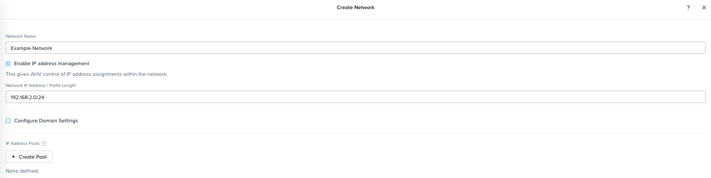

.. _lab_network_configuration:

------------------------------
Networking Configuration Lab
------------------------------

Overview
++++++++

Learn how to set up a network in the cluster using Prism. The networks you create in the steps below provide VMs with connectivity by assigning the appropriate networks for the VMs’ respective NICs.

AHV Networking Background
+++++++++++++++++++++++++

AHV leverages Open vSwitch (OVS) for all VM networking. OVS is an open source software switch implemented in the Linux kernel and designed to work in a multiserver virtualization environment. Each AHV server maintains an OVS instance, and all OVS instances combine to form a single logical switch.

Each node is typically uplinked to a physical switch port trunked/tagged to multiple VLANs, which will be exposed as virtual networks.

VM networking is configured through Prism (or optionally CLI/REST), making network management in AHV very simple. In the following exercise you will walk through virtual network creation in AHV.

With AHV, you can also setup a DHCP server to automatically provide IP addresses for VMs using the IP address management (IPAM) service. Meaning you don't have to setup a separate DHCP server for the network. Which makes network management easier.

Additional details about AHV networking can be found `here <https://nutanixbible.com/#anchor-book-of-ahv-networking>`_.

Virtual Networks
................

- Similar to a VMware “distributed portgroup”
- Each virtual NIC belongs to exactly one virtual network
- Each virtual network is a common point of configuration for a group of virtual NICs
- Physical switch port must be configured to trunk VLAN

Virtual NICs of VMs
...................

- Each vNIC of a VM belongs to exactly one virtual network
- For IPAM-enabled networks, vNICs get life-long static IP assignments
- User may configure pools to automatically allocate IPs, or specify the IP manually

.. figure:: images/network_config_02.png

IP Address Management (IPAM)
............................

- Integrated DHCP Server
- AHV intercepts DHCP requests from guests on IPAM networks, and injects responses
- Virtualization admin manages a range of IP addresses
- Supports arbitrary DHCP options, with UI support for DNS and TFTP configuration

.. figure:: images/network_config_03.png

Configure Network
+++++++++++++++++

.. note::

   In the following exercise you will emulate creating networks in Prism, however you will not be able to actually create the network due to how the emulated networking is configured within Test Drive. This is expected as the exercise is for demonstration/education purposes only.

Setup User VM Network
.....................

Connect to Prism Element and create a network for user VM interfaces.

#. In **Prism Element > VM**, click **VMs**, then click **Network Config**.

#. Select **VM Networks**, then click **+ Create Network**.

#. Observe the available fields and click **Cancel**:

   The configured virtual network will now be available across all nodes within the cluster. Virtual networks in AHV behave like Distributed Virtual Switches in ESXi, meaning you do not need to configure the same settings on each individual host within the cluster. When creating VMs in IPAM managed networks, the IP can optionally be manually specified during vNIC creation. Nutanix AHV also fully supports IPAM to allocate DHCP addresses automatically.

Takeaways
+++++++++

- It's very easy to setup a network in the cluster in order to establish VM connectivity.
- IPAM is very simple to setup within a network and it can greatly simplify IP management within the cluster.
