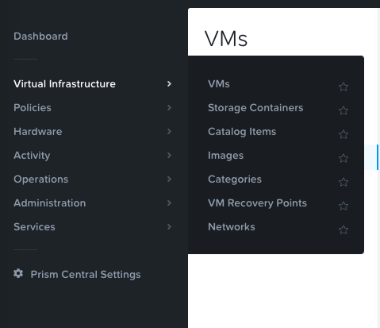
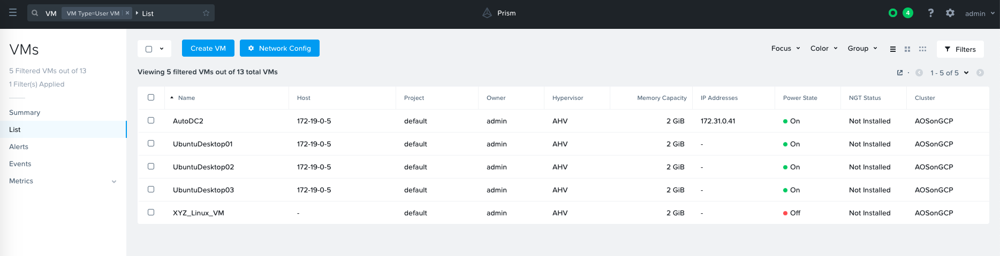
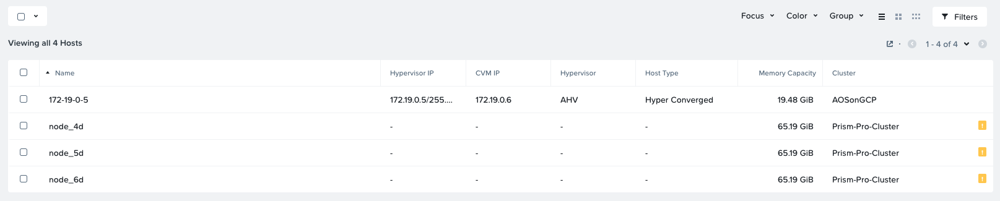
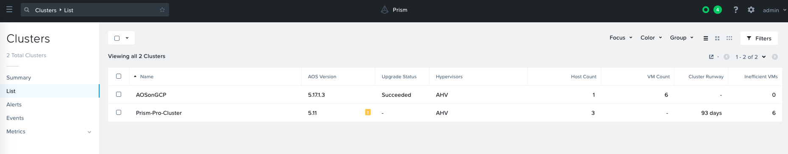

.. _prism_central_overview:

-----------------------
Prism Central: Overview
-----------------------

Overview
++++++++

This lab will introduce the Prism Central UI, and familiarize you with its layout and navigation.

Prism Central
+++++++++++++

#. Return to the original Test Drive Tab called "Prism Central"

#. Explore the information on the **Home** screen:

- Cluster Runway
- Cluster Quick Access
- Impacted Cluster | Alerts
- tasks

#. Click the Hamburger Menu on the top left and select **Virtual Infrastructure**. The menu will expand letting select a submenu, such as VMs, Storage Containers, Catalog Items, etc

#. Click on **VMs**. Note how all VMs on all clusters managed by this prism central instance appears. Also note how the search bar in the top left has been auto-populated with a list, filtering on type "User VM." This search query can be modified to list all VMs (click the **X** next to the filter VM Type=User VM). The search bar can be used to filter results for all entities that Prism Central Manages (eg. Hosts, Containers, Networks, etc)

#. Review the other sections, and do a quick walk through:

- Planning
- Analysis
- Apps (We will configure this later in the workshop)
- Alerts
- Tasks :fa:`circle-o`
- Search :fa:`search`
- Help :fa:`question`
- Configuration :fa:`cog`
- User :fa:`user`

.......................
Prism Central UI Review
.......................

How would you find the screen that shows you a table of all the hosts managed by an instance of Prism Central?

.. note::

  Because this Test Drive Prism Central instance is managing multiple clusters, this screen shows the hosts for all of the clusters being managed.

#. In **Prism Central select the Hamburger menu in the top left, then select **Hardware > Clusters**.

What page would show you the latest activity in the system? On this page, you can monitor the progress of any task and keep track of what has been done in the past using time stamps. Can you figure out two different ways to get there?

#. First Way, click the Hamburger menu **Activity > Tasks**. Second Way, click :fa:`circle-o` then choose "View All Tasks"

.. note::

  In ESXi:

  - vCenter Server instances can be registered to Prism via Prism's :fa:`cog` icon.
  - Registering a Nutanix Cluster running ESXi with vCenter allows to perform core VM management operations directly from Prism without switching to vCenter Server.
  - The vCenter Server that is managing the hosts in the cluster is auto-discovered and its IP address is auto-populated in the Address field as shown in the example below.

  Example view of vCenter registration to Prism:

  .. figure:: images/nutanix_tech_overview_15.png

Takeaways
+++++++++

- Prism is thoughtfully laid out UI
- Critical information is displayed front and center
- Prism Central can manage multiple clusters
